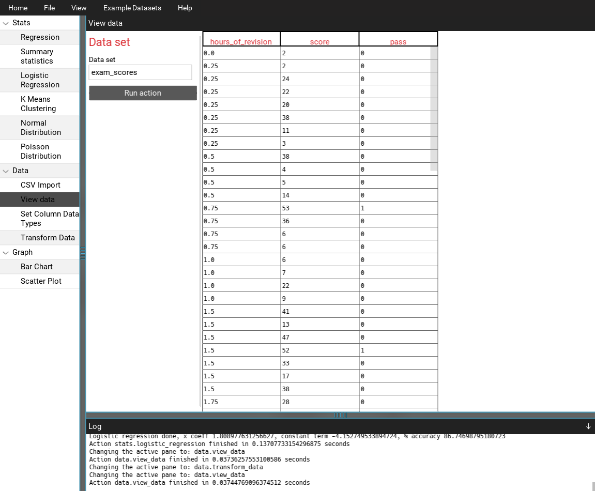
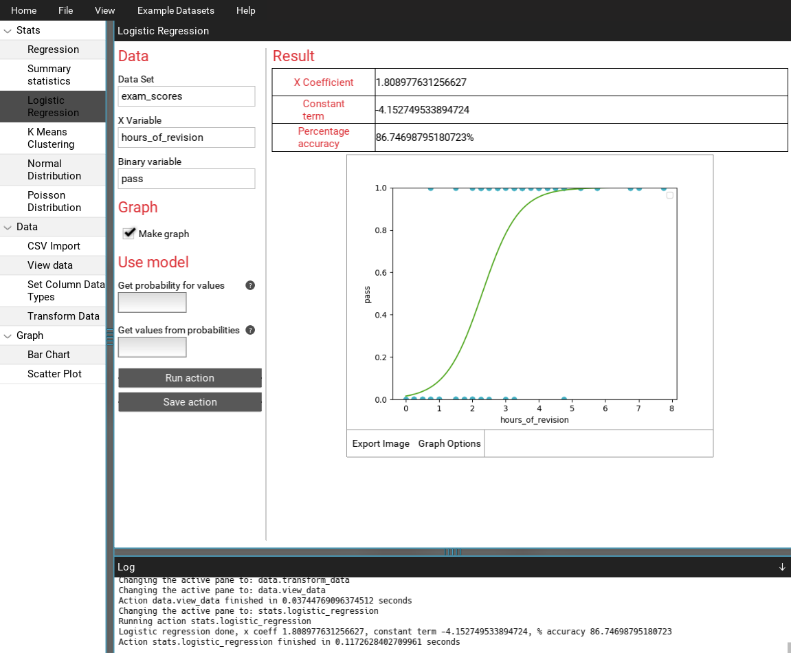
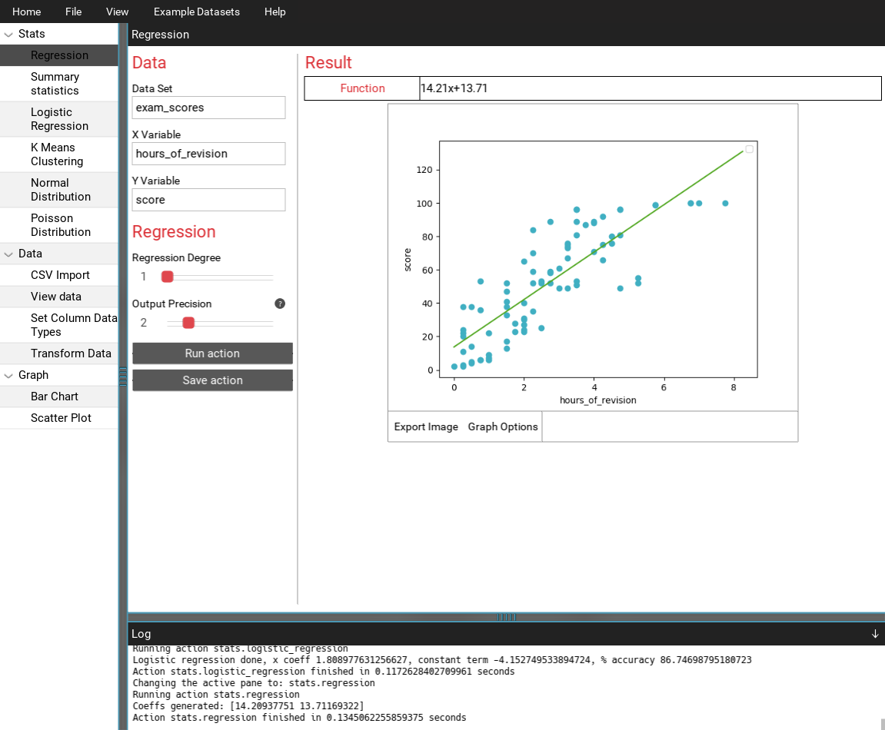

# Stat Analysis
This is a statistical analysis program written in Python using Kivy. I made this
for my A level computer science course, it features common statistical methods
such as polynomial regression, logistic regression and can generate bar charts
and scatter plots. 

## TODO:
* Have a base run method in the BaseAction class, that handles running
parts of the action that are and aren't shown to the user
* Implement multithreading for processes on startup, eg logistic
regression and K means clustering
* Introduce some kind of shell functionality
